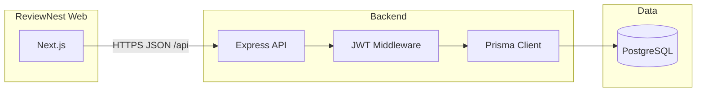

# ReviewNest

**ReviewNest** is a full-stack, role-based **store rating** platform: users discover stores and leave 1–5 star ratings, store owners track feedback for their businesses, and administrators manage users, stores, and global visibility from a single dashboard.

Built for the **Roxiler Systems** internship scope: clean REST APIs, JWT auth, PostgreSQL (e.g. Supabase), and a minimal but complete Next.js UI.

---

## Features

| Role | Capabilities |
|------|----------------|
| **User** | Sign up, log in, browse and search stores, submit/update ratings (1–5), change password, log out |
| **Store owner** | Log in, dashboard with per-store **average rating** and a list of **users who rated**, change password, log out |
| **Administrator** | Log in, dashboard totals (users, stores, ratings), create users (any role) and stores, filter user/store listings, see **aggregate rating for store owners** in the users table, log out |

---

## Tech stack

| Layer | Choice |
|-------|--------|
| **Frontend** | Next.js (App Router), React, TypeScript, Tailwind CSS, Axios |
| **Backend** | Node.js, Express, TypeScript |
| **Auth** | JWT (`Authorization: Bearer <token>`), bcrypt password hashing |
| **Database** | PostgreSQL via Prisma ORM, `@prisma/adapter-pg` driver |
| **Hosting DB (typical)** | Supabase (pooled `DATABASE_URL` + direct `DIRECT_URL` for migrations) |

---

## Repository layout

```
Roxiler Systems/
├── backend/                 # Express API
│   ├── prisma/
│   │   └── schema.prisma   # Users, stores, ratings + constraints
│   ├── prisma.config.ts     # Prisma CLI datasource (URLs from .env)
│   └── src/
│       ├── app.ts
│       ├── server.ts
│       ├── config/
│       ├── middleware/
│       ├── modules/         # auth, admin, user, stores, ratings, owner
│       └── routes/
├── frontend/                # Next.js app
│   ├── app/                 # pages: login, signup, role dashboards, settings
│   ├── components/
│   ├── contexts/
│   └── lib/
└── README.md                # this file
```

---

## Architecture



---

## Prerequisites

- **Node.js** 20+ recommended  
- **npm** (or pnpm/yarn with equivalent commands)  
- A **PostgreSQL** database (local or [Supabase](https://supabase.com/))

---

## Backend setup

```bash
cd backend
npm install
```

1. Copy environment variables:

   ```bash
   cp .env.example .env
   ```

2. Set **`DATABASE_URL`**, optional **`DIRECT_URL`** (required for Prisma migrate when using Supabase pooler), **`JWT_SECRET`**, and **`PORT`** (default `5000`).

3. Generate Prisma Client and apply migrations:

   ```bash
   npm run prisma:generate
   npx prisma migrate dev --name init
   ```

4. Start the API:

   ```bash
   npm run dev
   ```

   Health check: `GET http://localhost:5000/api/health`

---

## Frontend setup

```bash
cd frontend
npm install
```

1. Create **`frontend/.env.local`** (see `local-env.example`):

   ```env
   NEXT_PUBLIC_API_URL=http://localhost:5000/api
   ```

   The URL **must include the `/api` prefix** so it matches the backend mount point.

2. Start the dev server:

   ```bash
   npm run dev
   ```

   Open [http://localhost:3000](http://localhost:3000).

---

## First administrator

Public **sign up** only creates **normal users**. An **ADMIN** (and **STORE_OWNER**) account must exist before those roles can log in. Typical options:

1. Insert an admin user in the database with a **bcrypt**-hashed password, or  
2. Use a one-off seed script / SQL (not committed here), or  
3. If you already have one admin session, use **Administrator → Add user** in the UI with role `ADMIN` / `STORE_OWNER`.

---

## API overview

Base URL: **`/api`** (e.g. `http://localhost:5000/api`).

| Area | Examples |
|------|-----------|
| Auth | `POST /auth/signup`, `POST /auth/login` |
| Profile | `PUT /user/password` (users and store owners) |
| User stores | `GET /stores?search=` |
| Ratings | `POST /ratings`, `PUT /ratings/:id` |
| Admin | `GET/POST /admin/users`, `GET/POST /admin/stores`, `GET /admin/dashboard` |
| Owner | `GET /owner/dashboard`, `GET /owner/ratings` |

Validate inputs on the client where the UI shows hints; the API enforces rules (e.g. password complexity, unique email, one rating per user per store).

---

## Database model (summary)

- **users** — roles: `USER`, `STORE_OWNER`, `ADMIN`  
- **stores** — optional `owner_id` → users  
- **ratings** — `user_id`, `store_id`, `rating`; **unique** on `(user_id, store_id)` so each user rates a store at most once (updates via `PUT /ratings/:id`)

---

## Production notes

- Set strong **`JWT_SECRET`**, never commit **`.env`** / **`.env.local`**.  
- Configure CORS in `backend/src/app.ts` for your real frontend origin.  
- Use `npm run build` in both `backend` and `frontend` for production builds; run `node dist/server.js` and `next start` respectively.

---

## Name

**ReviewNest** — a single place for users to leave opinions and for businesses to see how they are perceived.

---

## License

Provided as internship / portfolio work unless otherwise specified.
